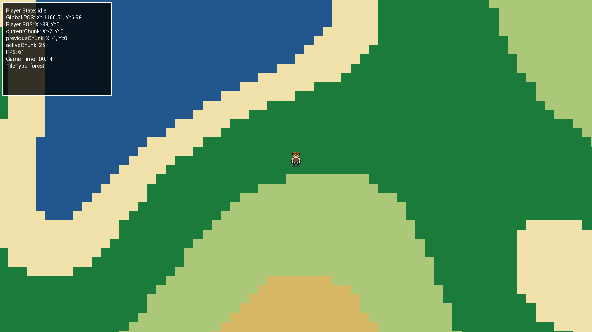

# ESRO Game (ecrp_cpp)

**ESRO** is a C++-based game. This repository (`ecrp_cpp`) holds the game engine code, state management, resources, and configuration needed to build and run the game.

---

## Table of Contents

- [About the Project](#about-esro)  
- [Features](#game-features)

---

## About ESRO

ESRO is a game developed in **C++**,
As an scientist, you are sent back in time to stop an event from happening. Explore past earth and identify early civilization to help them be better and remove the hatered from their hearts.

In an open world environment, you will explore the world and interact with the environment and people and help them in their evolution in being better rather than destructive homo sapiens.

---

## Game Features

- **Open World 2D based game**
- **Procedural world with new envirnoments, climate, civilizations etc**
- **First in its type without inventory management but world with full of resourcs**
- **In-built AI assistant as guide**
- **Intelligent people and animal management**: Includes Google Test (via `vcpkg` packages) to write unit tests for game logic (if tests are added / maintained).

---

## Supported CLI Commands

ESRO supports direct execution arguments from PowerShell or Command Prompt to alter startup states configuration.

| Feature Command | Short Flag | Description |
| :--- | :--- | :--- |
| `--no-splash` | `-ns` | Completely bypasses the opening graphical splash screen sequence. |
| `--debug` | `-d` | Forces the engine to boot directly into internal Debugging Mode. |

### 🛠️ Execution Example
To bypass the splash screens and run the game with active debug overlays, run the executable directly from your terminal:
```powershell
.\build\bin\Debug\ESRO.exe --no-splash --debug

---

## Game Performance - 21/06/2026
- FPS = +570
- Build Time - 8.831 ms
- Build Size - 1,345 KB